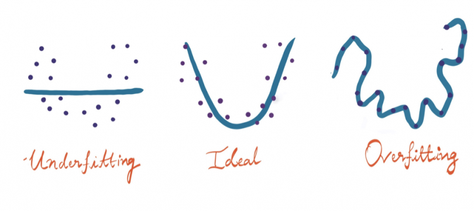

# df-ai

> what you want to do is create a model that scores all potential moves and executes the one with the highest rating... so you want to select a model using model selection and regress on it
>
> read the docs of scikit learn -- how ml works is you feed it a training dataset, it creates a model based on the dataset, and then you can feed it new inputs and it decides based on the model it has generated from the training data  
> -0xhank

## Resources

- [discord thread](https://discord.com/channels/793602508311232542/945812025458688010)
- https://scikit-learn.org/stable/tutorial/basic/tutorial.html
- https://scikit-learn.org/stable/auto_examples/classification/plot_digits_classification.html#sphx-glr-auto-examples-classification-plot-digits-classification-py
- What is model selection? https://machinelearningmastery.com/a-gentle-introduction-to-model-selection-for-machine-learning/

(in my understanding,)

when you are training some cool AI with different strategies, how should you pick the right one? Well, with
**_model regression_** you can choose the best one and win df.

Regression is some magical thing no one understands. as explained by numerous images, underfitting is when the line doesn't go through that many points , overfitting is when the line goes through too many points, and just right is when it goes trough a modest amount of points

(source: https://builtin.com/data-science/regression-machine-learning)